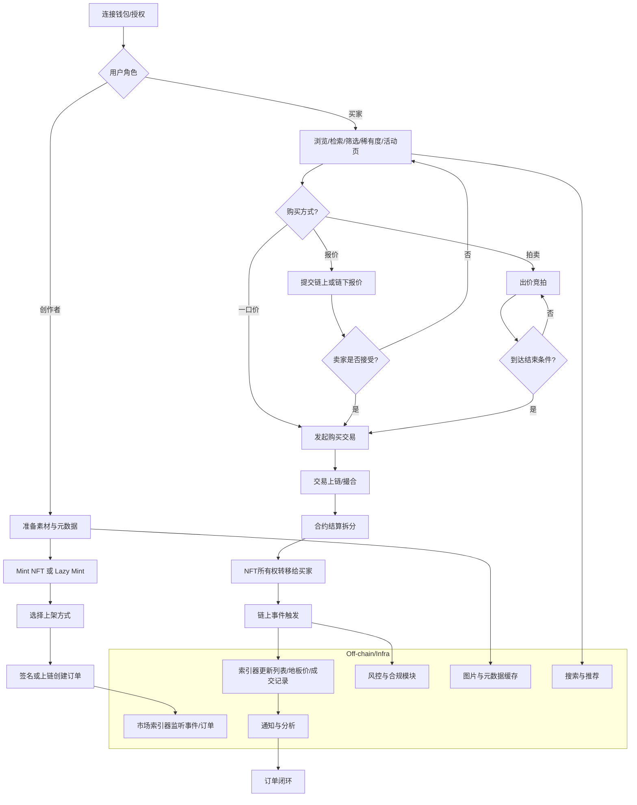

# NFT 市场通用业务流程（Aptos 生态适用）

本文描述 NFT 市场从“创作者上架 — 买家成交 — 结算拆分 — 索引更新”的端到端业务逻辑，并覆盖一口价、报价、拍卖三类常见路径。

## 流程图

## 关键说明（精简版）

- 上架与订单
  - 一口价（Fixed-price）：最简单，买家直接以定价成交。
  - 报价（Offer）：买家签名意向单（可链下存储），卖家接受后再上链结算。
  - 拍卖（Auction）：常见英式/荷兰式；需处理最小加价、反狙击延时、可选保证金等。
- 资产与结算
  - 托管 vs 非托管：托管为上架即转入市场合约，非托管为成交时在授权下转移。
  - 分账：平台费、创作者版税、卖家净收入按比例自动分配。
- 索引与搜索
  - 监听合约事件驱动列表、地板价、成交历史与稀有度更新与缓存。
- 风控与合规
  - 洗交易识别、黑名单、反女巫；签名防重放；防抢跑/MEV（私有交易、延时）。

## 渲染方式（任选其一）
- GitHub：把上述代码块粘贴进 README.md 或 docs/Flow.md，提交后网页自动渲染。
- 在线：使用 Mermaid Live Editor（https://mermaid.live）粘贴代码即时预览并导出图片。
- VS Code：安装 “Markdown Preview Mermaid Support” 或 “Markdown Preview Enhanced” 插件本地预览。
